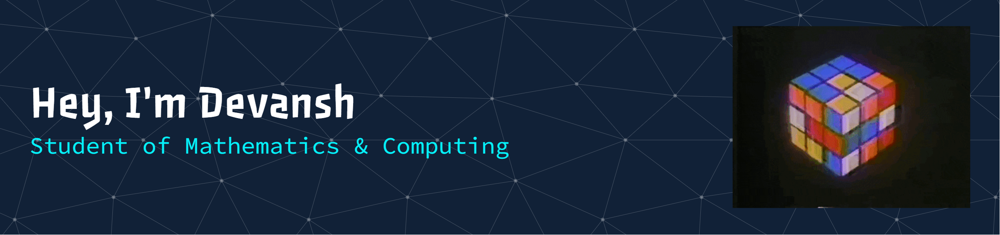

<!------ Header Banner ------>

---

<!------ About me ------>

### About me...

- I'm currently working on Data Structures & Algorithms, Machine Learning, and Web Development.
- I've explored Competitive Programming, DBMS, Operating Systems, Big Data Processing, and Exploratory Data Analysis.
- I have strong foundations in Mathematics subjects like, Optimization, Numerical & Computational methods, Modelling & Simulation, Mathematical Statistics etc.
- I like, and I am comfortable in connecting mathematical ideas to real life problems, and finding efficient solutions using computational or analytical methods.
- In future, I would like to explore Deep Learning, .
- Planning to contribute more actively to open source and collaborative projects.

---

<!------ Profile views ------>

<!-- 
  

--- -->

<!------ Social Media links ------>

### Let's Connect...

<!------ Languages and Tools ------>

### Things I code with...

